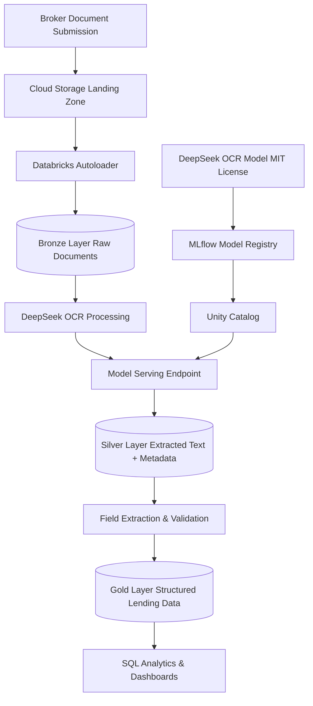

# DeepSeek OCR on Databricks - UK Merchant Bank Lending Document Ingestion Demo

## Overview

This demo will showcase deploying DeepSeek OCR on Databricks to process broker-submitted lending documents for a UK merchant bank, extracting structured data and ingesting it into a Delta Lake-based lakehouse.

## Document Types & Formats

**Target Documents for Demo:**

- **Loan Applications & Facility Agreements** (PDF, scanned)
- **Financial Statements** - Balance sheets, P&L, Cash flow (PDF, multi-page)
- **Term Sheets & Credit Memoranda** (PDF)
- **Invoices & Trade Documents** (PDF, images)
- **Collateral Valuations** - Property appraisals, asset schedules (PDF, scanned)
- **Corporate Documents** - Articles of association, board resolutions (PDF)
- **Bank Statements** (PDF, scanned)

**Formats:** PDF (native & scanned), TIFF, JPG, PNG

## Test Datasets & Sample Documents

**Recommended Data Sources:**

1. **Public OCR Datasets** (adapted for financial context):

   - **SROIE** - Scanned receipts/invoices dataset (good for structured extraction)
   - **FUNSD** - Form understanding dataset (useful for applications/forms)
   - **RVL-CDIP** - Document classification dataset (includes invoices, forms, letters)
   - **DocBank** - Document layout analysis dataset

2. **Synthetic Lending Documents:**

   - Generate template-based loan agreements using Python/Jinja2
   - Create synthetic bank statements and financial statements
   - Mock collateral valuation reports

3. **Public Financial Documents:**

   - Companies House UK filings (publicly available PDFs)
   - UK SME annual reports and accounts
   - SEC EDGAR filings (adapt for UK context)

4. **Template Sources:**

   - Legal document templates from UK government websites
   - Anonymized/redacted broker document templates

## Architecture



## Implementation Plan

### Phase 1: Environment Setup

**1.1 Databricks Workspace Configuration**

- Create Databricks workspace with Unity Catalog enabled
- Set up GPU-enabled cluster (A100 or V100 recommended for DeepSeek OCR)
- Configure cloud storage (AWS S3/Azure ADLS) for document landing zone
- Install required libraries: `transformers`, `torch`, `pillow`, `pdf2image`, `mlflow`

**1.2 Unity Catalog Setup**

- Create catalog: `lending_documents`
- Create schemas: `bronze`, `silver`, `gold`
- Configure permissions for demo users

### Phase 2: DeepSeek OCR Model Setup

**2.1 Model Acquisition & Testing**

- Download DeepSeek OCR model weights (MIT license - on-premises deployment)
- Test locally with sample lending documents
- Evaluate different model sizes (Tiny/Large/Gundam) for accuracy vs. speed

**2.2 MLflow Model Packaging**

- Create custom MLflow `pyfunc` wrapper for DeepSeek OCR
- Include preprocessing: PDF to image conversion, resolution normalization
- Include postprocessing: Markdown/HTML parsing, confidence scoring
- Test model wrapper locally

**2.3 Model Registration**

- Log model to MLflow with dependencies and example inputs
- Register in Unity Catalog: `lending_documents.models.deepseek_ocr_v1`
- Tag with version, accuracy metrics, and use case metadata

### Phase 3: Model Deployment

**3.1 Databricks Model Serving Endpoint**

- Create serving endpoint: `deepseek-ocr-lending`
- Configure compute: GPU-enabled (A100 recommended)
- Set auto-scaling: 1-3 instances based on load
- Enable authentication and rate limiting

**3.2 Batch Inference Setup**

- Create Databricks Job for batch processing
- Configure for scheduled runs (hourly/daily broker document drops)
- Implement error handling and retry logic

**3.3 Testing & Validation**

- Test with sample documents from each category
- Measure throughput (pages/hour) and accuracy
- Validate output format consistency

### Phase 4: Data Ingestion Pipeline

**4.1 Bronze Layer - Raw Document Ingestion**

Create notebook: `01_bronze_ingestion.py`

- Use Databricks Autoloader to monitor landing zone
- Ingest PDFs/images as binary data
- Store metadata: filename, upload timestamp, source (broker ID), file size
- Create Delta table: `bronze.raw_documents`

**4.2 Silver Layer - OCR Processing**

Create notebook: `02_silver_ocr_extraction.py`

- Read from `bronze.raw_documents`
- Convert PDFs to images (handle multi-page documents)
- Call DeepSeek OCR serving endpoint or batch inference
- Extract full text, preserved layout, tables (HTML/Markdown)
- Store in Delta table: `silver.extracted_text` with columns:
  - `document_id`, `page_number`, `raw_text`, `structured_markdown`, `confidence_score`, `processing_timestamp`

**4.3 Gold Layer - Structured Data Extraction**

Create notebook: `03_gold_structured_data.py`

- Apply regex and NLP parsing to extract key fields:
  - **Borrower information**: Name, company number, address
  - **Facility details**: Loan amount, currency, tenor, interest rate
  - **Dates**: Application date, approval date, maturity date
  - **Document type classification**: Agreement, statement, valuation, etc.
- Use LLM-based extraction for complex fields (optional: call Databricks Foundation Models)
- Validate extracted data (business rules, completeness checks)
- Create dimension and fact tables:
  - `gold.dim_borrowers`
  - `gold.dim_documents`
  - `gold.fact_loan_facilities`
  - `gold.fact_financial_statements`

### Phase 5: Sample Data Preparation

**5.1 Dataset Collection**

- Download SROIE dataset for invoice samples
- Download FUNSD dataset for form samples
- Scrape 20-30 Companies House UK filings (PDFs)
- Create synthetic data script

**5.2 Synthetic Document Generation**

Create script: `generate_synthetic_docs.py`

- Generate 50 loan agreement PDFs with varying layouts
- Generate 30 bank statement PDFs
- Generate 20 financial statement PDFs
- Include variations: different fonts, scanned quality levels, multi-column layouts
- Use `reportlab` or `weasyprint` for PDF generation

**5.3 Ground Truth Labeling**

- Manually label 20 documents with expected extraction fields
- Create validation dataset for accuracy testing
- Store ground truth in `gold.validation_labels`

### Phase 6: Orchestration & Monitoring

**6.1 Workflow Orchestration**

- Create Databricks Workflow: `lending_document_pipeline`
- Chain notebooks: Bronze → Silver → Gold
- Configure triggers: File arrival or scheduled
- Set up notifications for failures

**6.2 Data Quality Monitoring**

- Track OCR confidence scores over time
- Monitor extraction accuracy against ground truth
- Alert on low confidence or failed extractions
- Create dashboard showing:
  - Documents processed per day
  - Average confidence score
  - Processing time per document
  - Extraction success rate by document type

**6.3 SQL Analytics Dashboard**

- Create SQL queries showcasing lakehouse value:
  - Total lending facilities by broker
  - Average loan amounts and tenors
  - Document processing SLA compliance
  - Most common document types received
- Build Databricks SQL dashboard for business users

### Phase 7: Demo Presentation Components

**7.1 End-to-End Demo Notebook**

Create: `demo_walkthrough.py`

- Upload sample broker document (loan agreement PDF)
- Show real-time OCR processing via serving endpoint
- Display extracted text and structured data
- Query resulting data in Gold layer
- Visualize extraction results

**7.2 Sample Queries**

```sql
-- Find all loan facilities over £1M
SELECT borrower_name, facility_amount, facility_tenor
FROM gold.fact_loan_facilities
WHERE facility_amount > 1000000
  AND currency = 'GBP';

-- Document processing metrics
SELECT 
  document_type,
  COUNT(*) as total_docs,
  AVG(confidence_score) as avg_confidence,
  AVG(processing_time_seconds) as avg_processing_time
FROM silver.extracted_text
GROUP BY document_type;
```

**7.3 Presentation Materials**

- Architecture diagram showing data flow
- Before/After comparison: Unstructured PDF → Structured data
- ROI metrics: Time saved, accuracy improvements
- Compliance talking points: On-premises DeepSeek OCR for data residency

### Phase 8: Documentation & Best Practices

**8.1 Technical Documentation**

- README with setup instructions
- Model deployment guide
- Troubleshooting common issues
- API documentation for serving endpoint

**8.2 Compliance Documentation**

- Data handling procedures for UK merchant bank
- Model governance and lineage (Unity Catalog)
- Audit trail of document processing
- Data retention policies

**8.3 Future Enhancements**

- Active learning: Flag low-confidence extractions for human review
- Multi-model ensemble: Combine DeepSeek OCR with NER models
- Real-time streaming: Process documents as they arrive
- Integration with downstream lending systems

## Key Technologies

- **DeepSeek OCR**: MIT-licensed, on-premises OCR engine
- **Databricks**: Unified analytics platform
- **Unity Catalog**: Data governance and model registry
- **Delta Lake**: Lakehouse storage format
- **MLflow**: Model lifecycle management
- **Autoloader**: Incremental file ingestion
- **Databricks SQL**: Analytics and dashboards

## Success Metrics

- **Accuracy**: >95% field extraction accuracy on validation set
- **Throughput**: Process 100+ documents per hour
- **Latency**: <10 seconds per document (single page)
- **Data Quality**: >90% confidence score on extracted text
- **Business Value**: Demonstrate 80% time reduction vs. manual data entry

## Estimated Timeline

- **Phase 1-2 (Setup & Model)**: 2-3 days
- **Phase 3 (Deployment)**: 1-2 days
- **Phase 4 (Pipeline)**: 3-4 days
- **Phase 5 (Sample Data)**: 2-3 days
- **Phase 6-7 (Orchestration & Demo)**: 2-3 days
- **Phase 8 (Documentation)**: 1-2 days

**Total**: 11-17 days for complete implementation
