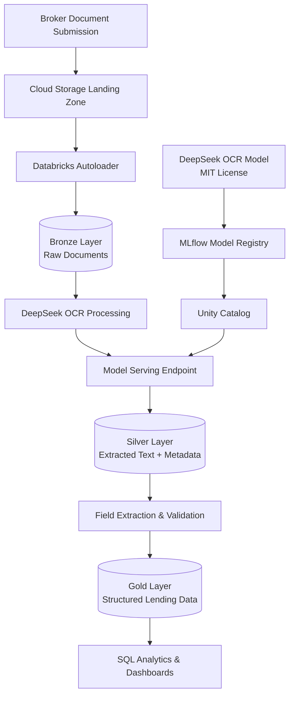

# UK Merchant Bank OCR Demo - DeepSeek on Databricks

This repository contains a complete demonstration of deploying DeepSeek OCR on Databricks to process UK merchant bank lending documents and ingest them into a lakehouse architecture.

## 🎯 Project Overview

**Use Case**: A mid-sized UK merchant bank receives lending documents from brokers in various formats and quality levels. This demo shows how to use DeepSeek OCR to automatically extract text and structured data from these documents, ingesting them into a Delta Lake-based lakehouse for analysis.

**Key Technologies**:
- **DeepSeek OCR**: MIT-licensed, on-premises OCR engine with 97% accuracy
- **Databricks**: Unified analytics platform with lakehouse architecture
- **Delta Lake**: Reliable data storage with ACID transactions
- **Unity Catalog**: Data governance and model registry
- **MLflow**: Model lifecycle management

## 🔄 Code Reuse

Shared modules ensure identical functionality between local and Databricks:
- ~95% code reuse via shared `generators/`, `config.py`, `scan_effects.py`
- Same seed → same output
- Edit once → applies everywhere

[View Architecture →](CODE_REUSE_GUIDE.md)

## 📚 Documentation

### Quick Links

| Document | Description |
|----------|-------------|
| [**IMPLEMENTATION_PLAN.md**](IMPLEMENTATION_PLAN.md) | Complete 8-phase implementation plan |
| [**CODE_REUSE_GUIDE.md**](CODE_REUSE_GUIDE.md) | Shared code architecture |
| [**DATA_GENERATION_SUMMARY.md**](DATA_GENERATION_SUMMARY.md) | Document generation overview |
| [**data_gen/QUICKSTART.md**](data_gen/QUICKSTART.md) | Getting started guide |
| [**data_gen/README.md**](data_gen/README.md) | Document generator details |
| [**databricks_notebooks/README.md**](databricks_notebooks/README.md) | Databricks setup guide |

## 🚀 Quick Start

### Choose Your Approach

**Option A: Local Generation (Recommended for Development)**

Generate documents on your local machine:

```bash
cd data_gen

# Install dependencies
pip install -r requirements.txt

# Test your setup
python test_setup.py

# Generate 40 synthetic lending documents
python generate_all.py

# Add realistic scanning artifacts
python add_scan_effects.py --percentage 30
```

**Time:** ~5 minutes | **Output:** 40 pristine + 12 scanned PDFs

---

**Option B: Databricks Notebooks**

Generate documents directly in Databricks workspace:

1. Upload `data_gen/` folder to Databricks Workspace or Repos
2. Create Unity Catalog volume:
   ```sql
   CREATE VOLUME lending_documents.raw_data.synthetic_docs;
   ```
3. Import and run `databricks_notebooks/01_generate_documents_modular.py`
4. (Optional) Run `databricks_notebooks/03_add_scan_effects.py` for quality variations

**Output:** PDFs in Unity Catalog Volume, ready for OCR pipeline

📖 **[Databricks Setup Guide](databricks_notebooks/README.md)**

---

## 🏭 Next Steps: Deploy on Databricks

Follow the [IMPLEMENTATION_PLAN.md](IMPLEMENTATION_PLAN.md) to:

1. **Setup Environment** (Phase 1)
   - Configure Databricks workspace with GPU cluster
   - Set up Unity Catalog
   - Configure cloud storage

2. **Deploy DeepSeek OCR** (Phase 2-3)
   - Download and package model
   - Register in MLflow
   - Create serving endpoint

3. **Build Data Pipeline** (Phase 4)
   - Bronze Layer: Raw document ingestion
   - Silver Layer: OCR text extraction
   - Gold Layer: Structured data parsing

4. **Create Demo** (Phase 7)
   - End-to-end notebook
   - SQL analytics dashboard
   - Presentation materials

## 📁 Project Structure

```
custom_ocr_demo/
├── README.md                          # This file
├── IMPLEMENTATION_PLAN.md             # 8-phase implementation plan
├── CODE_REUSE_GUIDE.md                # Shared code architecture
├── DATA_GENERATION_SUMMARY.md         # Document generation overview
│
├── databricks_notebooks/              # Databricks notebooks
│   ├── README.md                      # Setup guide
│   ├── 01_generate_documents_modular.py  # Document generation
│   └── 03_add_scan_effects.py        # Scan effects
│
└── data_gen/                          # Local & shared modules
    ├── README.md                      # Documentation
    ├── QUICKSTART.md                  # Getting started
    ├── requirements.txt               # Dependencies
    ├── config.py                      # ← Shared configuration
    ├── scan_effects.py                # ← Shared scan effects
    ├── test_setup.py                  # Setup verification
    ├── generate_all.py                # Local generation script
    ├── add_scan_effects.py            # Local scan script
    │
    ├── generators/                    # ← Shared generators
    │   ├── __init__.py
    │   ├── document_utils.py
    │   ├── loan_agreements.py
    │   ├── term_sheets.py
    │   └── financial_statements.py
    │
    └── outputs/                       # Generated PDFs (gitignored)
        ├── loan_agreements/
        ├── term_sheets/
        ├── financial_statements/
        ├── scanned/
        └── manifest.txt
```

## 📄 Document Types

### Loan Facility Agreements (5-8 pages)
Full UK-style facility agreements with proper legal structure:
- Parties and definitions
- Facility terms and conditions
- Financial covenants
- Security package details
- Repayment schedules
- Signature blocks

**Sample loan amounts**: £500K - £50M

### Broker Term Sheets (2-3 pages)
Concise deal summaries that brokers send to lenders:
- Transaction overview
- Key commercial terms
- Borrower profile and financials
- Security package
- Broker recommendations

### Financial Statements (3-4 pages)
Complete UK company accounts:
- Profit & Loss statement
- Balance Sheet
- Notes to accounts
- Key financial ratios
- Director signatures

## 🎨 Quality Levels

Documents are generated at three quality levels to test OCR robustness:

| Quality | Description | Usage |
|---------|-------------|-------|
| **Pristine** | Clean, native PDFs | 70% of documents |
| **Light Scan** | Minimal artifacts | 20% of documents |
| **Heavy Scan** | Significant degradation | 10% of documents |

## 🏗️ Architecture



## ⏱️ Timeline

| Phase | Description | Duration |
|-------|-------------|----------|
| **Phase 0** | Generate test documents | 5 minutes |
| **Phase 1-2** | Environment & Model Setup | 2-3 days |
| **Phase 3** | Model Deployment | 1-2 days |
| **Phase 4** | Data Pipeline (Bronze→Silver→Gold) | 3-4 days |
| **Phase 5** | Sample Data & Testing | 2-3 days |
| **Phase 6** | Orchestration & Monitoring | 2-3 days |
| **Phase 7** | Demo Materials | 2-3 days |
| **Phase 8** | Documentation | 1-2 days |
| **TOTAL** | | **11-17 days** |

## ✅ Success Metrics

- **Accuracy**: >95% field extraction accuracy on validation set
- **Throughput**: Process 100+ documents per hour
- **Latency**: <10 seconds per document (single page)
- **Data Quality**: >90% confidence score on extracted text
- **Business Value**: 80% time reduction vs. manual data entry

## 🔒 Compliance & Security

**Important for UK Financial Services:**

- ✅ **On-premises deployment**: DeepSeek OCR runs locally (MIT license)
- ✅ **Data residency**: All data stays within your Databricks workspace
- ✅ **FCA compliant**: No third-party API calls or data sharing
- ✅ **Audit trail**: Complete lineage via Unity Catalog
- ✅ **Governance**: Role-based access control

## 🛠️ Prerequisites

### For Document Generation
- Python 3.8+
- pip package manager

### For Databricks Deployment
- Databricks workspace with Unity Catalog
- GPU-enabled cluster (A100 or V100 recommended)
- Cloud storage (AWS S3 / Azure ADLS / GCP GCS)
- MLflow Model Registry access

## 📊 Demo Flow

1. **Show raw documents**: Mixed quality PDFs from brokers
2. **Demonstrate ingestion**: Autoloader picks up new files
3. **OCR processing**: DeepSeek extracts text with high accuracy
4. **Structured output**: Show Silver layer with extracted text
5. **Parsed data**: Display Gold layer with structured fields
6. **Analytics**: Run SQL queries on lending data
7. **Dashboard**: Visualize key metrics and trends

## 💡 Key Features

### Realistic Synthetic Data
- UK-specific company names, addresses, legal terminology
- Varied document formats and layouts
- Proper accounting (balance sheets balance!)
- Realistic financial ratios and covenants

### Production-Ready Code
- Extensive documentation and comments
- Error handling and logging
- Configurable parameters
- Reproducible with seeds

### Comprehensive Pipeline
- Bronze→Silver→Gold medallion architecture
- Data quality checks and validation
- Monitoring and alerting
- SQL analytics ready

## 🤝 Contributing

This is a demo project. To customize:

1. **Modify document parameters**: Edit `data_gen/config.py`
2. **Add document types**: Create new generators in `data_gen/generators/`
3. **Adjust OCR logic**: Modify pipeline notebooks (created in Phase 4)
4. **Extend analytics**: Add queries and dashboards (Phase 7)

## 📖 Additional Resources

- [DeepSeek OCR Documentation](https://docs.vllm.ai/projects/recipes/en/latest/DeepSeek/DeepSeek-OCR.html)
- [Databricks Lakehouse Architecture](https://www.databricks.com/glossary/medallion-architecture)
- [MLflow Model Registry](https://mlflow.org/docs/latest/model-registry.html)
- [Unity Catalog](https://docs.databricks.com/data-governance/unity-catalog/index.html)

## 🎓 Learning Path

1. **Start here**: Generate documents (`data_gen/QUICKSTART.md`)
2. **Understand the plan**: Read `IMPLEMENTATION_PLAN.md`
3. **Setup Databricks**: Follow Phase 1 of implementation plan
4. **Deploy model**: Follow Phases 2-3
5. **Build pipeline**: Follow Phase 4
6. **Create demo**: Follow Phase 7

## 📞 Support

For issues with:
- **Document generation**: Check `data_gen/README.md` and comments in code
- **Databricks setup**: Refer to `IMPLEMENTATION_PLAN.md` Phase 1
- **OCR deployment**: See `IMPLEMENTATION_PLAN.md` Phases 2-3
- **Pipeline development**: Review `IMPLEMENTATION_PLAN.md` Phase 4

## 📝 License

This demo project uses:
- **DeepSeek OCR**: MIT License (on-premises deployment)
- **Databricks**: Requires commercial license
- **Generated code**: Free to use and modify for your demos

---

**Ready to start?** Run `cd data_gen && python test_setup.py` to begin! 🚀
